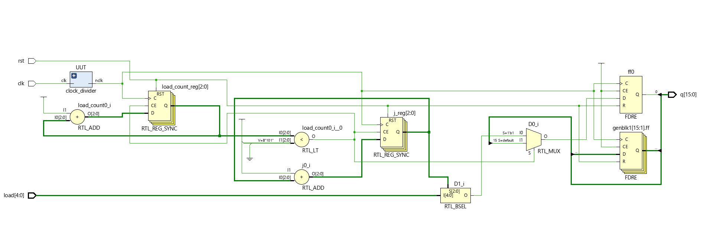
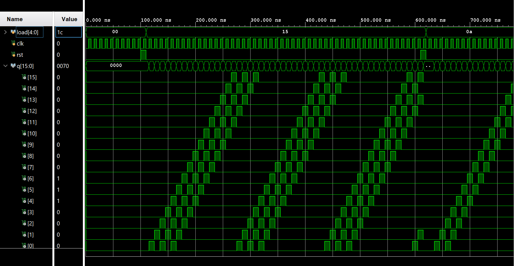

# Configurable LED Pattern

This project implements a configurable LED pattern display on the Basys 3 FPGA board. A **5-bit pattern** can be loaded and rotated through the **16 output LEDs**. The design allows for dynamic reloading of the pattern at any time by asserting the reset signal high.

---

## Key Features

- **Pattern Length:** 5-bit  
- **Output Display:** 16 LEDs on Basys 3 board  
- **Pattern Control:**
  - **Reset High:** Loads new pattern into the rotation
  - **Automatic Rotation:** Begins after 5 clock cycles

---

## Schematic

---

## How It Works

- **Pattern Loading:**
  - A 5-bit input is connected to a **load register**.
  - When reset is high, the **first 5 FDRE flip-flops** receive their input from this register through a **multiplexer**.

- **Rotation Logic:**
  - Once a **5-count internal counter** completes, the **mux input switches**, disconnecting the load register.
  - From this point, the outputs begin rotating across all 16 LEDs.

- **Flip-Flop and Mux Control:**
  - Each flip-flop is implemented using **FDRE** primitives.
  - **Multiplexers** control whether the flip-flop receives input from the load register or the previous output (for rotation).

---

## Output Waveform

---

## Output Verification

- The circuit was simulated in **Vivado**, and waveforms were analyzed.
- The loaded pattern was matched against expected rotation behavior.
- The design was implemented on the **Basys 3 FPGA**, where:
  - LED output matched the 5-bit pattern during load.
  - Continuous circular rotation followed the loading phase.

---

## Notes

- **Clock Divider:** You may need to adjust the clock divider to generate a slower clock to visually observe the pattern rotation on the Basys 3 board. This can help ensure the LED pattern is visible to the human eye as it rotates.
